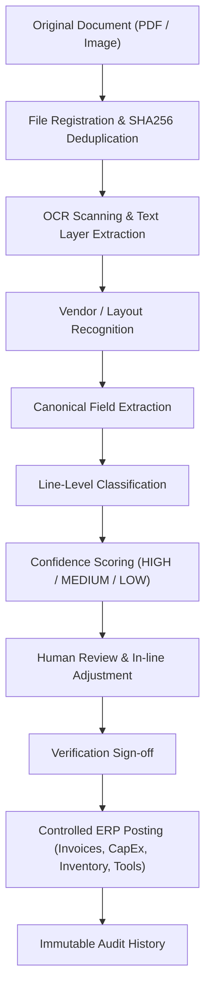
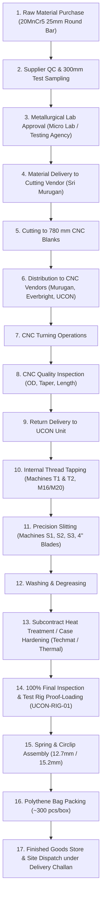
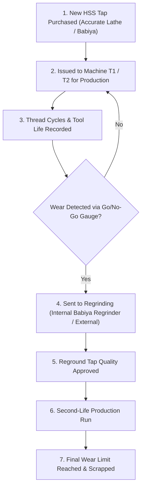

# UCON WEDGE ERP — ORGANIZED MASTER REQUIREMENTS

## PERMANENT MASTER REFERENCE AND ARCHITECTURAL SPECIFICATION

- **Version**: 2.0 (Consolidated Master Requirements Reference)
- **Status**: ACTIVE & APPROVED PERMANENT MASTER REFERENCE
- **Date Established**: 21 September 2026
- **Project**: UCON WEDGE MANUFACTURING MANAGEMENT SYSTEM (WEB & MOBILE)
- **Active Workspace**: `D:\Ucon Wedge Unit\ucon_wedge_erp_v2\`
- **Database**: PostgreSQL 17 on `localhost:5432` (`ucon_wedge`)

---

> [!IMPORTANT]
> **PERMANENT MEMORY PRINCIPLE**:
> This document is the permanent single source of truth for the UCON Wedge ERP project. Future development, AI assistants, and engineering teams must read and respect this document. No requirement herein may be silently omitted, altered, or replaced with assumptions during ongoing development, refactoring, or chat session transitions.

---

# 1. DOCUMENT INTELLIGENCE AND OCR

### Objective
The Document Intelligence subsystem must accept original scanned documents (PDFs, images, multi-page bills) and automatically:
1. **Read the document using OCR** (Tesseract / high-resolution canvas rasterization).
2. **Identify the document type** (Invoice, Delivery Challan, Material Test Certificate, Purchase Order, General Expense).
3. **Recognize vendor-specific layouts and terminology** (Ace Micromatic, Accurate Engineering, Sri Murugan, Techmat, NG Steels, etc.).
4. **Extract information into standardized canonical fields**.
5. **Classify each line item independently** (distinguishing machines, tooling, raw material, consumables, subcontract charges within the same document).
6. **Display confidence metrics and source evidence** for every extracted field and line item.
7. **Allow human correction and verification** in an interactive UI prior to committing to the ERP.
8. **Post only verified information into the ERP** database.

### Processing Workflow


> [!CAUTION]
> **CRITICAL RULE**: OCR data must ALWAYS remain an uncommitted proposal until an authorized user inspects, corrects, and verifies it. No unreviewed OCR result may be directly committed as an official financial transaction.

---

# 2. CANONICAL FIELD LIBRARY

The ERP maintains one centralized, extensible canonical field library. All incoming vendor formats and layouts normalize their extracted data into these standard fields.

### A. Vendor and Company Details
| Canonical Field | Type | Purpose / Description |
| :--- | :--- | :--- |
| `vendor_name` | String | Display name appearing on the document |
| `legal_name` | String | Registered legal entity name |
| `vendor_id` | UUID | Foreign key link to ERP `vendors` master |
| `gstin` | String | 15-character GST registration number |
| `pan` | String | 10-character Permanent Account Number |
| `vendor_address` | String | Registered or billing address of the vendor |
| `delivery_address` | String | Material delivery / ship-to location |
| `contact_details` | String | Phone number, email address, contact person |
| `vendor_type` | String | Subcontract, Steel, CNC, Tapping, Slitting, Heat Treatment, Tools, Consumables |

> [!NOTE]
> A vendor may supply across multiple categories over time (e.g., both machines and spares, or tooling and subcontracting). Therefore, the system must **never** permanently lock a vendor to a single rigid category.

### B. Document Identification
| Canonical Field | Type | Purpose / Description |
| :--- | :--- | :--- |
| `document_type` | String | `INVOICE`, `DC`, `PO`, `MTC`, `QUOTATION`, `EXPENSE` |
| `invoice_number` | String | Supplier invoice reference number |
| `document_number`| String | General document reference |
| `po_number` | String | Purchase order reference (`USS/IND/LPO/...`) |
| `po_date` | Date | Date printed on the purchase order |
| `dc_number` | String | Delivery challan reference number |
| `reference_number` | String | Vendor-specific internal reference |
| `invoice_date` | Date | Date printed on the invoice |
| `document_date` | Date | Date applicable to the transaction |
| `due_date` | Date | Payment due date |
| `financial_year` | String | Automatically derived (e.g. `2024-25`, `2025-26`) |
| `source_file_name` | String | Original uploaded filename |
| `source_page_no` | Integer | Page number where the information was found |

### C. Tax and Accounting Fields
| Canonical Field | Type | Purpose / Description |
| :--- | :--- | :--- |
| `hsn_code` | String | Harmonized System of Nomenclature code (e.g., `84581100`, `7228`, `8207`) |
| `sac_code` | String | Services Accounting Code (e.g., `9988` for job-work / heat treatment) |
| `subtotal_amount`| Decimal | Taxable value before taxes |
| `cgst_amount` | Decimal | Central Goods and Services Tax amount |
| `sgst_amount` | Decimal | State Goods and Services Tax amount |
| `igst_amount` | Decimal | Integrated Goods and Services Tax amount |
| `gst_total` | Decimal | Total GST (`cgst + sgst + igst`) |
| `discount_amount`| Decimal | Trade or cash discount deducted |
| `freight_amount` | Decimal | Transportation and shipping charges |
| `packing_charges`| Decimal | Packing, forwarding, and handling charges |
| `other_charges` | Decimal | Loading, insurance, or misc charges |
| `round_off` | Decimal | Rounding adjustment |
| `total_amount` | Decimal | Net grand total payable on the invoice |
| `tds_amount` | Decimal | Tax Deducted at Source (if applicable) |
| `payment_status` | String | `UNPAID`, `PARTIAL`, `PAID` |

### D. Line-Item Fields
Every invoice line must be independently captured, itemized, and categorized:
| Canonical Field | Type | Purpose / Description |
| :--- | :--- | :--- |
| `line_no` | Integer | Sequential line number on the document |
| `description` | String | Raw extracted item description from document |
| `normalized_desc`| String | Cleaned, standardized item description |
| `part_item_no` | String | Manufacturer part / catalogue / serial number |
| `quantity` | Decimal | Quantity invoiced |
| `unit` | String | Unit of measure (`Nos`, `EA`, `Kg`, `Set`, `Mtr`, `Barrels`) |
| `unit_rate` | Decimal | Unit price per item |
| `taxable_amount` | Decimal | Net taxable line amount (`qty * unit_rate - discount`) |
| `tax_rate` | Decimal | Applicable GST percentage (e.g. `18.00%`, `12.00%`, `28.00%`) |
| `tax_amount` | Decimal | Tax amount for this specific line |
| `total_amount` | Decimal | Gross line amount including tax |
| `hsn_sac` | String | Line-level HSN or SAC code |
| `category_code` | String | ERP category (`MACHINES_CAPEX`, `RAW_MATERIAL`, `CNC_TOOLS`, `TAPPING_TOOLS`, `SLITTING_TOOLS`, `CONSUMABLES`, `HEAT_TREATMENT_EXPENSE`, `OTHER_EXPENSE`) |
| `process_stage` | String | Manufacturing stage (`RAW_MATERIAL`, `CUTTING`, `CNC`, `TAPPING`, `SLITTING`, `HEAT_TREATMENT`, `ASSEMBLY`, `PACKING`) |
| `dest_module` | String | Target ERP module (`Machines`, `Purchase`, `Tools`, `Inventory`, `Costing`) |
| `confidence` | Decimal | AI extraction confidence score (`0.00` - `1.00`) |
| `source_page` | Integer | Page where the item appears |
| `source_evidence`| String | Bounding text or raw OCR row |

#### Multi-Item Invoice Example
A single invoice from a vendor (such as a general supplier or engineering shop) may contain mixed items:
| Vendor Description | Quantity & Rate | ERP Category Code | ERP Destination Module |
| :--- | :--- | :--- | :--- |
| CNC Carbide Insert WNMG | 50 Nos @ ₹280.00 | `CNC_TOOLS` | **Tools** & Tool Life Register |
| Cutting Oil / Coolant Barrel | 1 Barrel @ ₹14,500.00 | `CONSUMABLES` | **Inventory** Store |
| Lathe Machine Purchase | 1 EA @ ₹1,675,000.00 | `MACHINES_CAPEX` | **Machines** (CapEx Register) |
| 20MnCr5 Round Bar 25mm | 2,500 Kg @ ₹72.00 | `RAW_MATERIAL` | **Purchase** & RM Stock |
| Turning Subcontract Jobwork | 1,000 Pcs @ ₹6.50 | `CNC_EXPENSE` | **Production** Subcontract Cost |

---

# 3. CLASSIFICATION STRUCTURE AND ERP DESTINATION MAPPING

### Main Document Classification Hierarchy
```
Purchase Documents
├── Raw Material (20MnCr5 steel bars, 25mm black bar, 26mm historical)
├── CNC Tools (Carbide inserts, tool holders, collets, drills, boring bars)
├── Tapping Tools (HSS taps M16/M20, Go/No-Go thread gauges, regrinding)
├── Slitting Tools (4-inch slitting saw blades, circular cutters)
├── Coolant and Oil (Product 1305 coolant barrels, slideway oil, grease)
├── Consumables (Retaining circlips, springs, polythene packing bags)
├── Machines (CNC lathe, tapping machines, slitting machines, regrinders, chamfering)
├── Machine Accessories (Chucks, jaws, steady rests, coolant pumps, splash guards)
├── Heat Treatment (Case hardening, tempering, carburizing job-work)
├── Labour / Service (Preventive maintenance, machine repair, calibration)
└── Other Expenses (Metallurgical lab testing, transport freight, electricity)
```

### ERP Destination Routing Matrix
| Document / Line Category | Primary ERP Destination | Secondary Modules Updated |
| :--- | :--- | :--- |
| **Steel Purchase (20MnCr5)** | `invoices` (`RAW_MATERIAL`) | `inventory_items` (`RM-20MNCR5-25`), `inventory_movements` (`RECEIPT`) |
| **Steel Mill Test Certificate**| `qc_inspections` / Quality Records | Document archive, linked to Raw Material Lot |
| **CNC Machine Purchase** | `capex` (Machine Asset Register) | `invoices`, `machines` (`MCH-CNC-01`), segregated from monthly wedge cost |
| **CNC Machine Accessories** | `tools` / `inventory_items` | `inventory_movements`, machine maintenance log |
| **Tapping Tools (M16/M20)** | `tools` (`TOOL-TAP-M16`, `TOOL-TAP-M20`) | `inventory_movements`, `tool_life_events` (`MCH-TAP-01/02`) |
| **Slitting Saw Blades (4")**| `tools` (`TOOL-SLIT-4IN`) | `inventory_movements`, `tool_life_events` (`MCH-CUT-01/02/03`) |
| **Coolant / Slideway Oil** | `inventory_items` (`CONS-COOLANT-1305`) | `inventory_movements` (`RECEIPT`), monthly shop-floor issue log |
| **CNC Job-Work Bill** | `invoices` (`SUBCONTRACT`) | `production_orders`, `monthly_expenses` (`CNC_JOBWORK`) |
| **Heat-Treatment Bill** | `monthly_expenses` (`HEAT_TREATMENT`) | `invoices`, batch cost allocation |
| **Spring Purchase (12.7/15.2)**| `inventory_items` (`CONS-SPRING-127/152`)| `inventory_movements` (`RECEIPT`), Assembly stage stock |
| **Packing Material (Polythene)**| `inventory_items` (`CONS-POLYBAG`) | `inventory_movements` (`RECEIPT`), Packing stage stock |
| **Delivery Challan (DC)** | `delivery_challans` / Material Movement | Subcontractor WIP ledger, transit tracking |
| **General / Maintenance Expense**| `monthly_expenses` (`MAINTENANCE`) | `invoices`, cash/bank voucher |
| **Machine Installation** | `capex` (`INSTALLATION`) | Fixed asset value addition |
| **Scrap Sale (Turnings & Borings)**| `scrap_sales` / Other Income | Credited against monthly manufacturing cost |

---

# 4. UCON WEDGE MANUFACTURING PROCESS

### Complete End-to-End Manufacturing Flow


---

# 5. RAW MATERIAL PROCESS

### Material Specifications
- **Current Standard**: 20MnCr5 (20 mm CRFI / 20MnCr5 alloy steel), **25 mm diameter** round black bar.
- **Historical Material**: Approximately **26 mm diameter** round bar was used in earlier production batches.
- **Incoming Bar Lengths**: Standard mill lengths of **5.7 metres** or **6.0 metres**.
- **CNC Blank Cut Length**: **780 mm** (the precise spindle length required for CNC turning).
- **Approved Steel Suppliers**:
  - NG Sales Corporation (NG Steels)
  - Srinivasa Industries
  - Thirupathi Bright Steel
  - Steel Magic
  - Materials Point LLP
  - AR Traders

### Document Chain & Traceability


### Mandatory QC Laboratory Testing Protocol
1. Before raw steel moves from the vendor or distributor yard, the UCON QC personnel inspect the heat/lot and cut a **300 mm test coupon**.
2. Accompanied by an official Ucon authorization letter, the sample is delivered to **Micro Lab Testing Services** (or an accredited metallurgical testing laboratory).
3. **Mandatory Testing Parameters**:
   - **Chemical Composition**: Carbon (C), Manganese (Mn), Chromium (Cr), Silicon (Si), Sulfur (S), Phosphorus (P) against 20MnCr5 specification.
   - **Hardness**: Core and surface hardness.
   - **Tensile Properties**: Yield strength, ultimate tensile strength, elongation.
4. **Release Gate**: Raw material moves forward to cutting **only after** an authorized passing laboratory test report is uploaded and approved in the ERP.

---

# 6. CUTTING AND CNC DISTRIBUTION

### Cutting Operation
- Steel bars (5.7m or 6.0m) are delivered directly to the cutting vendor (primarily **Sri Murugan Industry**) under a Delivery Challan.
- Bars are precision-sawn into **780 mm CNC blanks**.
- The cutting vendor provides:
  - Work Order reference
  - Inbound and Outbound Delivery Challans
  - Cut quantity (pieces of 780 mm blanks)
  - Raw material balance remaining in yard
  - End-piece scrap generated

### Allocation & Distribution Tracking (10-Tonne Example)
When a 10-tonne raw material heat lot is released, it is distributed across CNC vendors based on capacity:
| Allocated Destination | Quantity Allocated | Purpose / Operation |
| :--- | :--- | :--- |
| **Sri Murugan Industry** | 2.0 Tonnes (~1,320 blanks) | Subcontract CNC Turning |
| **Everbright Engineers** | 2.0 Tonnes (~1,320 blanks) | Subcontract CNC Turning |
| **Approved CNC Vendor 3** | 2.0 Tonnes (~1,320 blanks) | Subcontract CNC Turning |
| **Approved CNC Vendor 4** | 2.0 Tonnes (~1,320 blanks) | Subcontract CNC Turning |
| **UCON In-House CNC** | 2.0 Tonnes (~1,320 blanks) | Internal CNC Turning Centre |
| **Total Heat Lot** | **10.0 Tonnes** | **~6,600 Total CNC Wedge Blanks** |

### Complete Lot Traceability Chain
```
Raw Material Lot (Heat No)
       ↓
Cutting Batch (Murugan Industry)
       ↓
CNC Vendor Allocation (Murugan / Everbright / UCON)
       ↓
Subcontract Work Order
       ↓
Material Outgoing Delivery Challan (DC)
       ↓
CNC Finished Quantity Produced
       ↓
Dimensional QC Rejection Quantity
       ↓
Accepted Quantity Passed
       ↓
Return Inbound Delivery Challan to UCON
```

---

# 7. PRODUCTION CONVERSION REFERENCE

### Conversion Thumb-Rule
$$\mathbf{1\text{ Tonne of 20MnCr5 Steel}} \approx \mathbf{6,600\text{ CNC Wedges}}$$

> [!IMPORTANT]
> **REFERENCE ASSUMPTION ONLY**:
> The value of `6,600 wedges / tonne` is stored as a reference engineering assumption for planning and variance tracking. It must **never** be hardcoded as an immutable, unquestioned yield. Real production yield varies depending on bar diameter (25mm vs 26mm), end-cut scrap, parting width, and subcontractor process efficiency.

### ERP Production Metrics Tracked per Batch
- **Input Tonnage**: Total weight of raw steel issued (Kg / Tonnes).
- **Expected Wedge Quantity**: Calculated based on standard conversion (`input_tonnes * 6,600`).
- **Actual CNC Wedge Quantity**: Actual turned wedges delivered by vendor.
- **Rejection Quantity**: Pieces rejected during incoming QC (taper, bore, undersize).
- **Scrap Quantity**: Weight of turnings, borings, and bar ends generated.
- **Yield Percentage**: $\frac{\text{Accepted Wedges}}{\text{Expected Wedges}} \times 100\%$.
- **Vendor-Wise Production Comparison**: Rejection and yield variance across vendors.

---

# 8. CNC OPERATIONS

### Known CNC Subcontractors
1. **Sri Murugan Industry** (Primary cutting and turning partner)
2. **Everbright Engineers** (CNC turning partner)
3. **UCON In-House CNC Unit** (Ace Micromatic CNC Lathe `MCH-CNC-01`)
4. **Other Authorized CNC Job-Workers**

### Historical CNC Rate Tracking
Subcontract turning rates change periodically based on steel grade, electricity, and volume. The ERP maintains an effective-date rate card:
```
Vendor ID
       ↓
Effective From Date & Effective To Date
       ↓
CNC Turning Rate per Piece (e.g. ₹6.00, ₹6.50, ₹7.00)
       ↓
Subcontract Work Order Reference
       ↓
Quantity Turned & Received
       ↓
Gross Job-Work Amount
       ↓
Rejection Quantity Deduction
       ↓
Debit Note / Credit Note Adjustments
       ↓
Net Payable Amount
```

### CNC Tooling & Inserts Tracking
The CNC process requires high-precision carbide inserts and tooling accessories:
- **Tool Types**: WNMG, CNMG, TNMG, VBMT, parting inserts, boring bars, collets, tool holders.
- **Suppliers**: Royal Tools, Prewo Tools, Micro Tech Precision, OVS Tools, Pioneer Tooling.
- **ERP Tracking Requirements**:
  - Purchase record, invoice number, and vendor.
  - Initial insert purchase cost and quantity.
  - Monthly insert consumption linked to CNC wedge quantity produced.
  - Tool life (number of wedges turned per insert corner / edge).
  - Regrinding history (internal on Babiya regrinder vs external).
  - Calculated insert tooling cost per finished wedge.
  - Real-time tool crib inventory balance.

---

# 9. TAPPING PROCESS

### Workshop Machinery
- **Tapping Machine T1**: Automated Tapping Machine #1 (`MCH-TAP-01` — M16 internal threading).
- **Tapping Machine T2**: Automated Tapping Machine #2 (`MCH-TAP-02` — M20 internal threading).

### Required Tooling & Consumables
- High-Speed Steel (HSS) machine taps (M16 × 2.0, M20 × 2.5).
- Precision Thread Inspection Gauges: **Go Gauges** and **No-Go Gauges**.
- Product 1305 Specialized Tapping Coolant & Slideway Lubrication Oil.
- Heavy-duty lubricating grease.
- Carbide regrinding wheel accessories.

### Tapping Tool Lifecycle Architecture


### Cost Accounting Segregation
The ERP strictly separates:
1. **New Tap Purchases** (capitalized into tool inventory).
2. **External Regrinding Services** (operating process expense).
3. **Internal Regrinding Operations** (internal labour / consumable life event).
4. **Tap Consumption** (amortized tooling expense per tapped wedge).
5. **Thread Gauge Replacements** (quality tooling expense).
6. **Product 1305 Coolant Consumption** (operating consumable expense).

---

# 10. SLITTING PROCESS

### Workshop Machinery
- **Slitting Machine S1**: 3-Blade Slitting Machine #1 (`MCH-CUT-01`).
- **Slitting Machine S2**: 3-Blade Slitting Machine #2 (`MCH-CUT-02`).
- **Slitting Machine S3**: 3-Blade Slitting Machine #3 (`MCH-CUT-03`).
*(Machine count expanded from S1 to S3 as factory production volume increased).*

### Critical Repeating Tooling
- **Slitting Saw Blades**: Standard **4-inch diameter** high-speed circular slitting cutters.
- Multiple blade trials conducted to determine optimal blade life and tooth geometry.
- Primary long-term supplier: **Accurate Engineering Works**.

### Strict Vendor Distinction Rule
> [!CAUTION]
> **DO NOT MERGE SIMILARLY NAMED VENDORS**:
> The ERP must strictly distinguish between separate legal entities with similar names:
> - **Accurate Engineering Works**: Supplier of slitting machinery, slitting saw blades, and heavy cutter tooling.
> - **Accurate Auto Lathe (Accurate Lathe)**: Subcontractor and supplier for tapping tools, M16/M20 taps, and Go/No-Go thread inspection gauges.
>
> The ERP vendor master must maintain distinct vendor IDs, GSTINs, and bank accounts for each.

---

# 11. HEAT TREATMENT (CASE HARDENING)

### Approved Subcontract Partners
- **Techmat Metallurgical Services**
- **Unitherm Engineers / Thermal**
- **Ambattur Heat Treaters**

### Operational Workflow


### Cost Allocation Dimensions
Heat treatment expenditure must be reportable across 5 distinct dimensions:
1. **Vendor-wise**: Techmat vs. Thermal vs. Ambattur spend and rates.
2. **Quantity-wise**: Total pieces heat-treated vs. weight in kilograms.
3. **Month-wise**: Total monthly subcontract heat-treatment expenditure.
4. **Per-Piece Basis**: Precise heat-treatment cost per wedge (typically ₹1.80 – ₹2.50 per piece).
5. **Batch Traceability**: Linked directly to the originating 20MnCr5 raw material heat lot.

---

# 12. TESTING AND ASSEMBLY

### Post-Hardening Workflow
1. Heat-treated wedges return to the UCON factory from the heat treatment plant.
2. **Incoming QC Verification**: Hardness testing across teeth and core (58–62 HRC surface specification).
3. **100% Proof Loading**: Wedges undergo mandatory load testing on UCON's specialized hydraulic testing rig (`UCON-RIG-01`).
4. **Spring / Circlip Fitting**: Internal spring assembly fitted into wedge groove.
5. **Functional Testing**: Verification of wedge bite, grip, and spring retraction.
6. **Final Packing**: Packed into heavy-duty polythene bags and labeled corrugated cartons.

### Spring Suppliers
- **Micromatic**
- **Viking Springs**
- **Grace Springs**
- *Spring Specifications*: 12.7 mm wire springs and 15.2 mm wire springs; retaining circlips.

### Packing Consumables
- Heavy-duty polythene packaging bags.
- Standard packing density: **Approximately 300 pieces per box**.
- Shipping cartons, industrial strapping, and tamper-evident labeling.
- **Inventory Tracking**: The ERP tracks purchases, opening stock, monthly consumption, damaged bags, and closing stock for all packing materials.

---

# 13. SCRAP MANAGEMENT

### Scrap Generation Sources
- **Cutting Scrap**: Bar ends (crop ends) generated during 780mm blank cutting at Sri Murugan.
- **CNC Turning Scrap**: Steel turnings and borings generated during outer diameter and taper machining.
- **Slitting Scrap**: Steel chips and offcuts generated during slitting on machines S1, S2, S3.
- **QC Rejections**: Rejected wedges discarded due to dimensional or metallurgical non-conformance.

### Scrap Commercial Tracking
The ERP records:
- Date of scrap generation and source production process.
- Accumulated weight in kilograms / tonnes.
- Storage location / designated scrap bin.
- Date of commercial scrap sale / collection.
- Scrap merchant / authorized scrap buyer name and GSTIN.
- Scrap sale rate per kilogram.
- Total commercial scrap realization value (₹).
- **Manufacturing Cost Offset**: Commercial scrap revenue is credited directly against raw material costs for the corresponding production month and batch.

---

# 14. MONTHLY BUSINESS SNAPSHOT ARCHITECTURE

The executive management dashboard organizes factory operational metrics chronologically by month from **January 2024 through September 2026 and forward**:

```
CALENDAR MONTH (e.g. October 2024)
│
├── 1. PRODUCTION QUANTITIES
│   ├── Opening Work-In-Progress (WIP)
│   ├── Raw Material Cut Blanks (Sri Murugan)
│   ├── CNC Turned Wedges (Vendor-wise breakdown)
│   ├── Tapped Wedges (Machines T1 & T2)
│   ├── Slit Wedges (Machines S1, S2, S3)
│   ├── Heat-Treated Wedges (Techmat / Thermal)
│   ├── Rig Proof-Tested Wedges (100% Load Tested)
│   ├── Finished Assembled Wedges (Spring & Circlip fitted)
│   └── Rejection Quantity (Stage-wise breakdown)
│
├── 2. RAW MATERIAL (20MnCr5 STEEL)
│   ├── Opening Stock (Kg)
│   ├── Purchased Tonnage (NG Steels, Srinivasa, etc.)
│   ├── Received & Approved Tonnage (Post-Lab QC)
│   ├── Issued to Cutting & CNC Vendors (Kg)
│   ├── Net Steel Consumed in Finished Production (Kg)
│   ├── Scrap Generated (Bar ends, turnings, borings)
│   └── Closing Raw Material Stock (Kg)
│
├── 3. MACHINERY & CAPEX INVESTMENTS (Segregated Fixed Assets)
│   ├── Machine Purchases (CNC Lathes, Tapping, Slitting, Regrinders, Chamfering)
│   ├── Major Capital Upgrades & Tooling Regrinders
│   └── Installation, Electrical & Structural Additions
│
├── 4. OPERATING EXPENDITURES (Direct Manufacturing Costs)
│   ├── CNC Subcontract Turning Jobwork (Murugan, Everbright)
│   ├── Internal CNC Tooling & Inserts (Royal Tools, Prewo, Micro Tech)
│   ├── Tapping Tooling & Consumables (Taps, gauges, 1305 coolant)
│   ├── Slitting Cutters & Blades (Accurate Engineering 4" saws)
│   ├── Heat Treatment Subcontracting (Techmat, Thermal)
│   ├── Springs & Assembly Hardware (Viking, Micromatic, Grace)
│   ├── Packing Materials (Polythene bags, cartons, strapping)
│   ├── Metallurgical Laboratory Testing Charges (Micro Lab)
│   ├── Shop Floor Direct Labour & Subcontract Wages
│   └── Factory Power, Maintenance Spares & Consumables
│
├── 5. COMMERCIAL CREDITS
│   └── Scrap Sales Income (Credited against monthly gross costs)
│
└── 6. EXECUTIVE COST INDICES
    ├── Total Net Manufacturing Expenditure (₹)
    ├── Total Finished Wedges Produced (Nos)
    └── Actual Realized Manufacturing Cost per Wedge (₹ / Wedge)
```

---

# 15. DATE AND HISTORICAL DATA RULES

### Immutability of Original Document Dates
1. The ERP must **strictly preserve the original document date** printed on the physical vendor invoice, Delivery Challan, or test certificate.
2. For every system transaction, the database records:
   - `document_date`: The physical date printed on the vendor document.
   - `posting_date`: The date and timestamp when the transaction was verified and posted.
   - `financial_year`: Standard Indian Financial Year (e.g. `2023-24`, `2024-25`, `2025-26`).
   - `calendar_month`: Standard sortable calendar month (`YYYY-MM`).
   - `vendor_id`: Verified link to vendor master.
   - `process_stage`: Specific manufacturing stage.
   - `production_batch`: Lot / batch code.
   - `source_document_id`: Foreign key link to the raw scanned document in `documents`.
   - `verified_by` & `verified_at`: User ID and timestamp of verification.

### Historical Query Capabilities (January 2024 to September 2026)
The database must instantly answer executive queries across the historical backlog:
- *"What was the total wedge production volume in January 2024?"*
- *"How many tonnes of 20MnCr5 steel were purchased in March 2025?"*
- *"How much was spent on M16 and M20 tapping tools in July 2026?"*
- *"What was the month-on-month trend in CNC turning cost per wedge across vendors?"*
- *"What is our cumulative capital investment in workshop machinery to date?"*
- *"Which month had the highest subcontract heat-treatment expenditure, and why?"*
- *"What is the actual production cost per wedge compared against our target cost?"*

---

# 16. AI LEARNING AND EXTRACTION RULES

### Continuous Learning Framework
The Document Intelligence subsystem does not rely on static coordinate templates. It operates on an adaptive extraction model:

$$\mathbf{Vendor\text{-}Specific\text{ Pattern}} + \mathbf{Canonical\text{ Field Library}} + \mathbf{Document\text{ Type}} + \mathbf{Historical\text{ Verified Examples}} + \mathbf{Human\text{ Corrections}} = \mathbf{Adaptive\text{ Extraction}}$$

### Rule Set for Discrepancies and Missing Fields
1. **Fields Present on Document**:
   - Extract the raw string.
   - Map it to the standardized canonical field.
   - Assign confidence based on keyword proximity and validation rules.
   - Retain source page number and OCR text snippet for audit evidence.
2. **Fields Absent from Document**:
   - If an invoice does not contain an HSN code or PO reference, leave the field `NULL`.
   - Mark status as `NOT_PRESENT_IN_DOCUMENT`.
   - **Never hallucinate or invent synthetic values**.
   - **Never copy values from other vendor invoices**.
3. **Field Extensibility**:
   - When new regulatory or business fields are introduced, add them to the centralized Canonical Field Library.
   - Update extraction regexes and scoring rules.
   - Automatically apply to all future incoming documents.
   - Provide an optional one-click re-scan feature for historical documents where source files exist.

---

# 17. HUMAN VERIFICATION AND AUDIT INTEGRITY

### Pre-Posting Verification Gate
No scanned document may enter the official financial or inventory ledgers until an authorized user verifies:
1. **Vendor Identity**: Vendor name matched or registered in the vendor master.
2. **Document Number & Date**: Document number verified unique (duplicate check) and document date confirmed.
3. **Amounts & Taxes**: Taxable subtotal, CGST, SGST, IGST, freight, and grand total mathematically balanced.
4. **Line-Item Classifications**: Category code (`MACHINES_CAPEX`, `RAW_MATERIAL`, `TOOLS`, `CONSUMABLES`) confirmed for every individual line.
5. **Duplicate Prevention**: SHA256 file hash and vendor + invoice number unique constraint validated.

### Immutability and Audit Logging
- Original uploaded scan files stored in `storage/documents/` are strictly **read-only and immutable**.
- All human edits during verification generate an immutable audit log entry in `audit_log`:
```
Original Extracted Value
       ↓
Reviewed / Corrected Value
       ↓
User ID & Role
       ↓
Exact Timestamp
       ↓
Audit Action ('CONTROLLED_ERP_POST' / 'LINE_EDIT' / 'DOCUMENT_DELETED')
```

---

## Document Confirmation & Master Authority
This document represents the permanent engineering and business foundation of the **UCON Wedge Manufacturing Management System**. All subsequent code modifications, database migrations, OCR routines, and reporting modules must comply with the specifications set forth herein.
